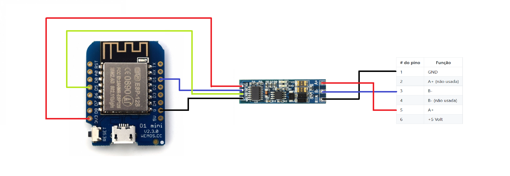
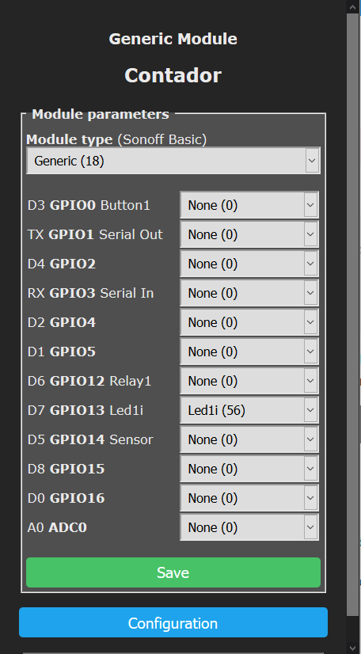
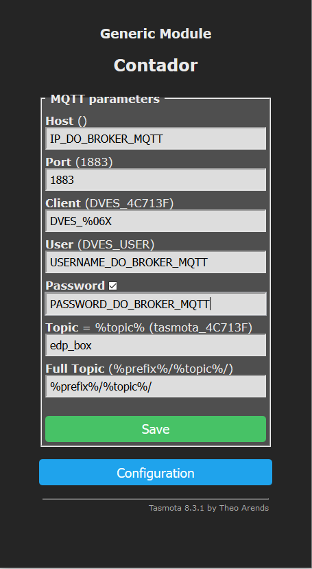

# Ligações

Os pinos Nº 1 `GND`, Nº 5 `(A+)` e Nº 3 `(B-)` existentes na porta HAN, correspondentes no chicote instalado pela `E-Redes S.A.`, deverão ser ligados aos terminais `GND`, `A+` e `B-` do conversor TTL vs RS-485:

>

A disponibilidade de alimentação a partir da porta HAN está limitada a uma intensidade de corrente máxima de 150 mA. **Recomenda-se não usar a porta HAN para alimentação de qualquer dispositivo.**

Entre os terminais `A+` e `B-` do conversor TTL vs RS-485, *poderá* eventualmente ser instalada em paralelo uma resistência de 120 Ohm. Mais info, [aqui](../EDP%20Box#impedância-de-linha).

**Deverá acautelar todos os requisitos e condições para este tipo de aplicação, segundo o documento fornecido pela `E-Redes S.A.`, vide `Módulos alimentados pela porta HAN`, [aqui](https://www.e-redes.pt/sites/eredes/files/2021-04/Requisitos%20dos%20m%C3%B3dulos%20HAN.pdf).**

# Configuração do perfil de GPIO

Deverá garantir que escolheu o perfil `Generic (18)`. Poderá modificá-lo, conforme o exemplo, para garantir que o LED integrado no Wemos funciona:

Não deverá alterar as configurações dos pinos `GPIO14` e `GPIO5`. Pois, são os configurados no script SMI que colocará no Tasmota, mais à frente.

# Configuração de MQTT no Tasmota

Deverá também acautelar a correta configuração do broker MQTT (IP, username, password, tópico MQTT, et al), nos menus de configuração do Tasmota, conforme o exemplo:

## Mais info

[Configuração do script para Smart Meter Interface (SMI)](./CONFIGURAÇÃO-SCRIPT-SMI.md)

[Voltar](./README.md)
